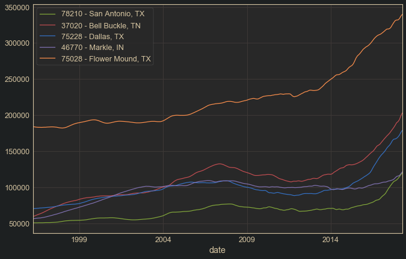
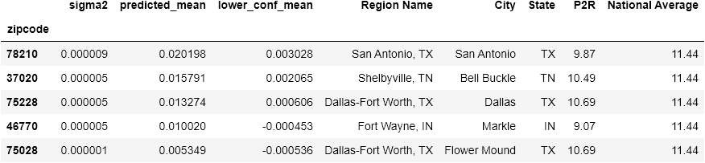

# Module 4 Project - Time Series Analysis
### Stephen Nathaniel Cibik

## Introduction
In this repository are all of the files related to my Module 4 Project for the Flatiron School's Data Science program. This project consisted of analyzing housing data from Zillow in order to consult an imaginary real estate investment firm on the top 5 zip codes to invest in. First, research was conducted on real estate consulting in order to gain domain understanding for the task. Next, an analytical approach was used to find the best 5 contending zip codes for investment of the 14,723 present in the data set. Then, much time was devoted to exploring the abilities of SARIMAX models to explain and forecast the data, as well as an exploration of heteroscedasticity filtering to attempt to handle inconsistencies caused by macroeconomic events, namely the 2007-2010 financial collapse.

In order to complete this project, it was necessary to do exploration in R as well as python, and to find ways to call R functions in the python work flow using rpy2. Time series analysis packages in both languages were explored in depth to maximize the ability to explain the data with time series modeling. A research project was conducted on heteroscedasticity filtering in an attempt to increase the efficiency of coefficient estimates, especially of a study by Stockhammar & Oller (2007), where the data used in the study was attained and a notebook was dedicated to replicating the workflow demonstrated in the paper. The use of fourier series as exogenous variables in SARIMAX models was explored. Helpful functions for time series analysis, spectral analysis and fourier series generation, and heteroscedasticity filtering were created and stored in a text file for use.

## Preview Images

## Folders
 - data : contains all csv files used in the project.
 - functions : contains all text files containing functions created for the project.
 - images : all image files generated for use in blog post and readme.
 - primary_notebooks : contains the main python and R notebooks of the project
 - research_notebooks : contains all python and R notebooks created in the research process.

## Notebooks
#### Primary Notebooks:
 - intro_and_data_understanding.ipynb : This notebook contains the domain research, data understanding and preparation, as well as the analysis to find the top 5 performing zip codes in the data.
 - modeling_whole_market.ipynb : This notebook contains all modeling of the combined market data using python using statsmodels' SARIMAX and Facebook Prophet.
 - modeling_zip_codes.ipynb : Contains all work related to modeling individual zip codes and comparing models to find best investment candidates.
 - ARIMA-GARCH_modeling_in_R.ipynb : This notebook contains ARIMA-GARCH modeling of the market data done with R using the forecast and rugarch packages.
 - ARIMA-GARCH_zip_w_heavy_losses.ipynb : This is a duplicate of the above notebook in which the workflow is repeated to focus on a single zip code which saw heavy losses during the market crash, in order to see if there was anything remarkable about the conditional volatility at that time.
#### Research Notebooks
 - recreating_Stockhammar&Oller_2007.ipynb : This notebook imports the GDP data used by Stockhammar & Oller in their 2007 paper "A Simple Heteroscedasticity Removing Filter" and recreates their workflow in python.
 - understanding_fourier_series_with_R.ipynb : An exploration in R of fourier series.
 - mod_4_project_notebook.ipynb : Project notebook which was eventually divided into the notebooks above due to size.
 - full_research.ipynb : Original unedited project file
 - ARIMA-GARCH_modeling_medians_in_R.ipynb : A duplicate of the R modeling notebook which compared the performance of the models on the median prices across zipcodes.